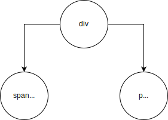
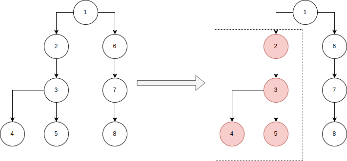

React does a fantastic job abstracting away the rendering of webpages. When state changes, our UI's reflect it. Have you ever gotten done writing your application just to notice things seem off? Clicking a button to display a popover stutters for a second. Or animations don't run smoothly.
With React being just a view layer there is a single bottleneck causing "jank" (stuttering in the interaction within a view)... Rendering. If our applications never had to render they'd all be blazing fast running at millions of frames per second (I had top scientists run the numbers)!
Fortunately we don't live in that world. Our applications are useful--they render and then re-render.

Because the majority of devices have screens refreshing 60 times a second, our applications have a short time-frame to update, render, and interact with users. [According to Google all work needs to be completed within 10ms](https://developers.google.com/web/fundamentals/performance/rendering/). Yes you read that right, 10ms. A daunting task. React gives us a lot of tools to take on this challenge. Let's take a look at a few of these tools.

### The DOM Tree

Before moving into improving React we need to take a step back. We need to get a few foundational ideas out of the way. The universal data structure of the internet is the [Tree](https://en.wikipedia.org/wiki/Tree_%28data_structure%29). HTML is built off of it.
If we consider the following HTML:

```html
<div>
  <span>Hello</span>
  <p>World</p>
</div>
```

Then the data structure representation would look like:



React takes the same DOM tree structure, and mirrors it in memory--called the Virtual DOM. Kind of like a cache is to I/O, the Virtual DOM is to the DOM Tree. It's faster to perform CRUD operations (Create, Read, Update, Delete) in the Virtual DOM, because not only are the operations cheaper in memory, but they're cheaper in execution time. The browser performs massive amounts of work when the DOM Tree is changed. Painting, layout, calculations, etc. The Virtual DOM skips all of this. It's only a representation of the DOM Tree.

When thinking in optimizing React, think of the Virtual and Browser DOM Tree. The less work each of these have to perform, the faster our applications behave!

### What causes React to render?

React has two main reasons to render: when a component's _state_ changes, or when its _props_ change. Out of the box React chooses the naive approach in deciding what needs re-rendered. Which is to re-render the node where the props/state changed, and any of its children nodes. In the figure below, say we change the state of node 2. Everything contained in the dashed line would also be re-rendered, because they are children of node 2.



Don't take this as a bad thing! React cannot make preconceived assumptions of how our application functions, so it chooses the most user friendly approach. It would be frustrating if we updated our application with a logged-in user prop, and the MenuBar component six layers deep didn't reflect this change.

### shouldComponentUpdate()

// TODO

### PureComponent/Memo

// TODO

Think of when a function receives arguments, like `add(1, 2)`. This function should always return the same result, 3. The same applies to React. If our component (function) takes the same arguments (props), then there is no reason to recalculate and render the result again.

### Extracting Components

// TODO
