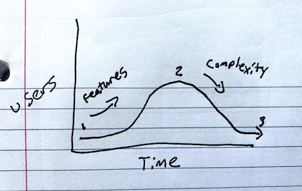

> Our default response to any idea that comes up should be: “Interesting. Maybe some day.” In other words, a very soft “no” that leaves all our options open. We don’t put it in a backlog. We give it space so we can learn whether it’s really important and what it might entail.

    
        <a href="https://basecamp.com/shapeup/1.2-chapter-03#responding-to-raw-ideas">"Shape Up" - Ryan Singer (Basecamp)</a>
    

Story time. At a previous employer I had a boss who I thought was pretty tough. Not to me, but our users. No matter the request his response was always the same, "No." Eventually, we implemented around 40% of the requests, but the constant rejection of these requests stuck with me. Now that I lead a team I notice myself using the same mindset. "No" isn't negative, and it's not dismissive. "No" is a way of protecting the team, the project, and the users.

### No?

There is a natural progression to projects that looks something like this. First, the honeymoon phase. The pastures are green; the project has no technical debt and every feature is a great idea. As we add functionality our user base grows. If we're lucky enough to get traction we move to phase two, the monolith. Our application now handles a bunch of use-cases. It does your taxes, picks up your dog's poop, and reminds you to call your mom. Only power users can fully grasp the purpose of the application. The technical debt is increasing with every new feature added. Finally, we get to the last phase. The application has become so bloated that it's hard to develop new features. New users aren't willing to learn the ins-and-outs of the product. A new startup comes around with a trimmed down version of your application. It's so easy to use! Around this time users are jumping ship.

Saying "no" is a buffer in our development process. It gives us, the developer, time to think of an optimal solution. Could a feature being asked for be solved in a way that satisfies multiple feature requests? Is there some domain logic we have yet to understand? Does the feature really make sense in _this_ application? All these questions help reduce the lifecycle described above. It reduces feature churn by keeping the application simple, and by solving issues the users actually have.

Be mindful of how features interacts within your application. Nothing comes without a cost--especially in software development.

### No.

"No" is a way of protecting people--the users and the development team. There is a gradient of experience when it comes to using your application. Users will be complete beginners, and others will be power users. As a product owner we need to balance these two extremes. If the application is too power-user-centric, then it's harder for new users to grok. When the application is too hand-holding, power users become frustrated. Saying "no" to one extreme is a way of keeping the scales balanced. But, be mindful of what you say "no" to. Some features may be vital to the application's success. This is part of the art.

"No" gives time to find the optimal solution to a problem. Users ask for a solution to **X** and suggest implementing **Y**, but what they really need is **K**. Feature requests give us an opportunity to improve processes and workflows. Our user's are domain experts, but are prone to do things they way they've "always done them". We can come in and find ways to simplify. Ask the user, "do we really need this step?" or "Could the system handle that instead of a person?" Once code is written and users get accustomed to the feature, it's really hard to change. Do this step upfront.

"No" keeps the development team doing meaningful work. Spending a sprint or two implementing a feature nobody uses or finds frustrating is demoralizing. Think about the workflow before writing any code. Question the feature and the users. Does the application need this? Could we implement it in a simple way? Reduce code churn; reduce developer churn.

### No!

Work needs to get done. At some point you need to say "yes", but instead of taking on every task, you get to be mindful on what to prioritize. You get to take on the tasks that add the most business value and delight users. Use "no" as a tool.
