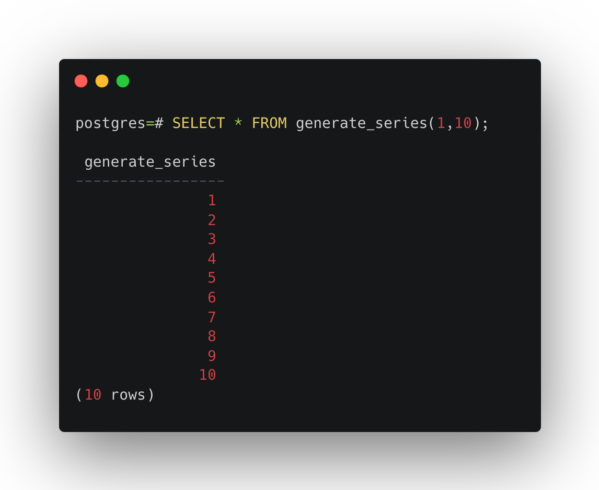
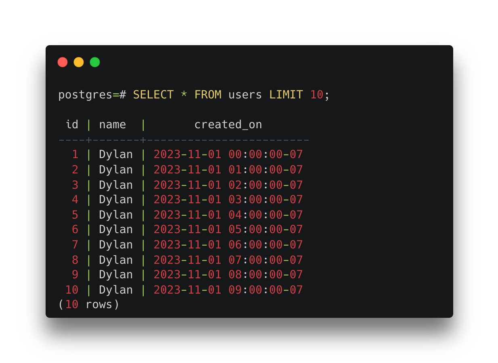

import { Accordion } from "../../../../components/Accordion";

When writing articles about PostgreSQL there are times I need to generate large swaths of data to test and demonstrate a topic (for example, these Timescale articles [here](https://www.timescale.com/blog/how-to-reduce-your-postgresql-database-size/) and [here](https://www.timescale.com/learn/how-to-reduce-bloat-in-large-postgresql-tables/)).
It can be a pain to manually insert data or create a CSV and import it into PostgreSQL--which I always have to StackOverflow.
Lately, I ran into a much simpler solution to generating data: the `generate_series` [function](https://www.postgresql.org/docs/current/functions-srf.html).
It's perfectly suited for integers and timestamp data types, streamlining various tasks such as populating test databases or setting up date ranges for reports.

## Generating Mock Data

`generate_series` can be thought of as a for-loop or generator to produce a range of numbers or dates.

To generate a range of numbers, we call `generate_series` with a start and end value:

```sql
SELECT * FROM generate_series(1, 10);
```



We can specify a step value by providing `generate_series` as an optional third argument.

```sql
SELECT * FROM generate_series(1, 10, 2.5);
```


### Inserting Mock Data

`generate_series`' power comes to fruition when we need to insert mock data into a table.
We can easily insert a range of numbers into a table by using `generate_series` in a `SELECT` statement and then inserting the results into a table.

For the rest of this article, we'll use `users` table that looks like this for our examples:

```sql
CREATE TABLE users (
 id serial PRIMARY KEY,
 name text NOT NULL,
 created_on timestamptz
);
```

Then, if we wanted to insert five users into the table we could run:

```sql
INSERT INTO users (name)
SELECT
    'Dylan'
FROM generate_series(1, 5);
```


This pattern can be used to insert any number of rows into a table.
If you're feeling brave, try inserting 1,000,000 users into the table by changing `generate_series(1, 5)` to `generate_series(1, 1000000)`!

Up to this point we are creating a lot of duplicate data.
What if we wanted to create a bunch of users with all distinct names?
We can access the current index of the loop (using `as`) to generate a unique name for each user.

That would look like this:

```sql
INSERT INTO users (name)
SELECT
    'Dylan number ' || i
FROM generate_series(1, 5) as i;
```


## Creating Time-Series Data

`generate_series` is incredibly effective at generating time series data.
This is where I get the most use out of it because it can become extremely tedious to create a lot of data around time ranges.

Similar to the integer example, generate a range of timestamps by providing a start and end value followed by an optional step or interval.

For example, to generate a user for every hour in a week, we could run the following SQL:

```sql
INSERT INTO users (name, created_on)
SELECT
    'Dylan',
    time_hour
FROM generate_series(
    TIMESTAMPTZ '2023-11-01',
    TIMESTAMPTZ '2023-11-07',
    INTERVAL '1 hour'
) as time_hour;
```



This query creates 146 rows with a user named Dylan every hour between November 1st and November 7th, 2023.

You may be asking yourself, can we use multiple `generate_series` to populate multiple fields? Yes!
But, we need to use joins to combine the data from the two series.
To quickly create a grid of users and created_on dates we can take the cartesian product of two series, otherwise known as a cross join, by adding another `generate_series` to the `FROM` clause.

<Accordion title="What is a Cartesian Product?" client:load>
    A cartesian product is the result of joining two tables
    where the result is the combination of every row in the first table with every row in the second table.

    For example, let's say we have two pants (blue jeans and sweatpants) and three shirts (t-shirt, polo, and sweatshirt).

    The cartesian product of our pants and shirts would look like:

    | Pants       | Shirts      |
    | ----------- | ----------- |
    | Blue Jeans  | T-Shirt     |
    | Blue Jeans  | Polo        |
    | Blue Jeans  | Sweatshirt  |
    | Sweatpants  | T-Shirt     |
    | Sweatpants  | Polo        |
    | Sweatpants  | Sweatshirt  |

</Accordion>

```sql
INSERT INTO users (name, created_on)
SELECT
    'Dylan number' || i,
    time_hour
FROM
    generate_series(1, 5) as i,
    generate_series(
        TIMESTAMPTZ '2023-11-01',
        TIMESTAMPTZ '2023-11-07',
        INTERVAL '2 days'
    ) as time_hour;
```

In the `INSERT` statement above, we'll create four `time_hour` timestamps for every two days in the week for every iteration of `i` (there are five of them).
Resulting in `4 * 5 = 20` twenty rows created.
To better grasp what's happening here, it'll be easier to look at the `SELECT` output of the users table.


Using multiple `generate_series` functions combined with a cartesian product can be a powerful combination for creating unique, time-series data.

## Conclusion

PostgreSQL's `generate_series` is a game-changer for developers like me, who frequently dive into the deep end of data generation for testing and optimizing queries. It's a powerhouse that can effortlessly create anything from a handful to millions of rows, transforming a potentially arduous task into a few simple lines of SQL.
So, when you need to mock up data, let `generate_series` be your go-to solution.

Happy data generating!
