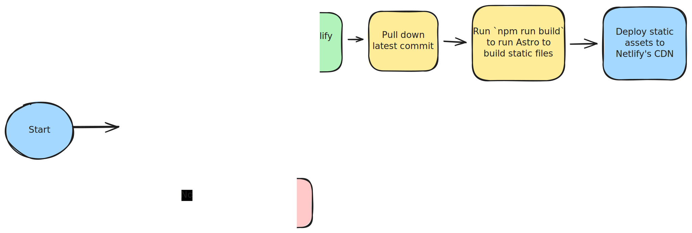

This site has been through a lot of different iterations: vanilla HTML, [Pico](https://picocms.org/), [Jekyll](https://jekyllrb.com/), [Gatsby](https://www.gatsbyjs.com/), and finally [Astro](https://astro.build/). 
Each framework brings its baggage over to the next. After using Astro for the past year+, I'm happy where things landed. 
A lot of code could be cleaned up from migrating between frameworks, different site designs, and failed experiments. 
But this is a real site that's been iterated on since 2013. Dang, 13 years...

## The Current Architecture

The driving architecture goals of this site are to be simple, easy to maintain, and low-cost.
This means that any kind of hosted server/backend is out the window. Use any free-tier or open-source solutions for everything.
Additionally, I don't want to manage any deployments. I'm lazy. Whenever a change happens, it should be released automatically without any manual steps. 

To achieve these goals, I landed on the following stack:

- **Porkbun**: The domain registrar and DNS provider
- **AstroJS**: The static site generator that builds the HTML, CSS, and JavaScript files for the site
- **TailwindCSS**: Makes styling the site easier
- **Preact**: Used to render the dynamic parts of the site
- **Netlify**: The free hosting provider that automatically deploys the site when changes are pushed to the repository
- **GitHub**: Repository for the site code

## AstroJS, TailwindCSS, and Preact. Oh my

AstroJS is a static site generator—a tool that produces static files (HTML, CSS, and JavaScript) from different sources. 
There's no server-side rendering (though Astro can do this too, but I don't use it), no database, no backend, no Docker. Just a bunch of files and an `index.html` file.
This fits perfectly with the criteria I mentioned earlier: low cost and simple to deploy.

I use AstroJS' templating for most of the page layouts and components to handle the static parts of the site. 
This makes templating and designing the site a breeze. For any dynamic parts, like when you click the sun or moon icon (in the upper right-hand corner of this site) to change from light to dark mode, I use Preact.
I chose Preact over React for its smaller bundle size, keeping the site load times fast. But, keeping most of the functionality of React.

Finally, TailwindCSS is a clear winner as my favorite way to style a site. I've used it in many jobs, and love to use it for personal projects.
Tailwind allows me to move fast, removing CSS headaches. 

## How changes deploy to the website

This website is hosted on Netlify, which I've been using for over five, maybe even ten, years now. I've lost track. 
Netlify has a lot of functionality, but I only use their free tier CI/CD (continuous integration and continuous deployment) and CDN (content delivery network). 

Netlify watches the GitHub repository for changes on the `master` branch. 
Once it does, a build is triggered in Netlify, which pulls down the latest commit, builds Astro to produce the static files (HTML, CSS, and JS), and publishes those files to the CDN.

## Future improvements

Going forward, it's time to clean up the baggage from previous frameworks and iterations of the site. There is definitely room to improve the CSS structure.
Additionally, I would like to further improve the searchability and ease of finding posts. 
A recent addition has been adding [PageFind](https://pagefind.app/) on the Posts page to allow you to search for articles more easily, and I would like to continue this trend.

I am constantly looking for ways to make this site not only easier for me to make updates to, but better for you, the reader, to use. 
If you have feedback or suggestions, feel free to drop an issue on the site's [GitHub](https://github.com/ganderzz/dylanpaulus.com/issues).