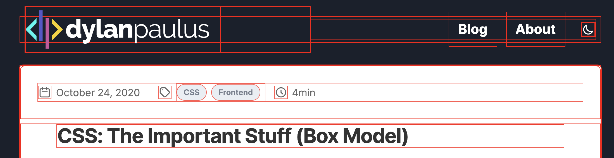
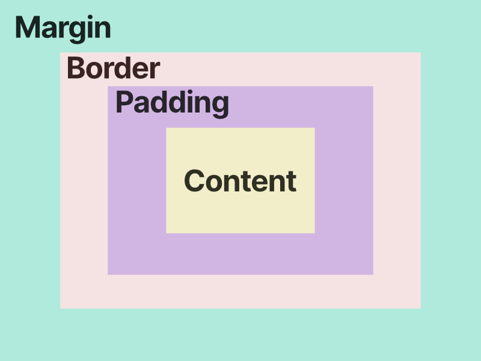
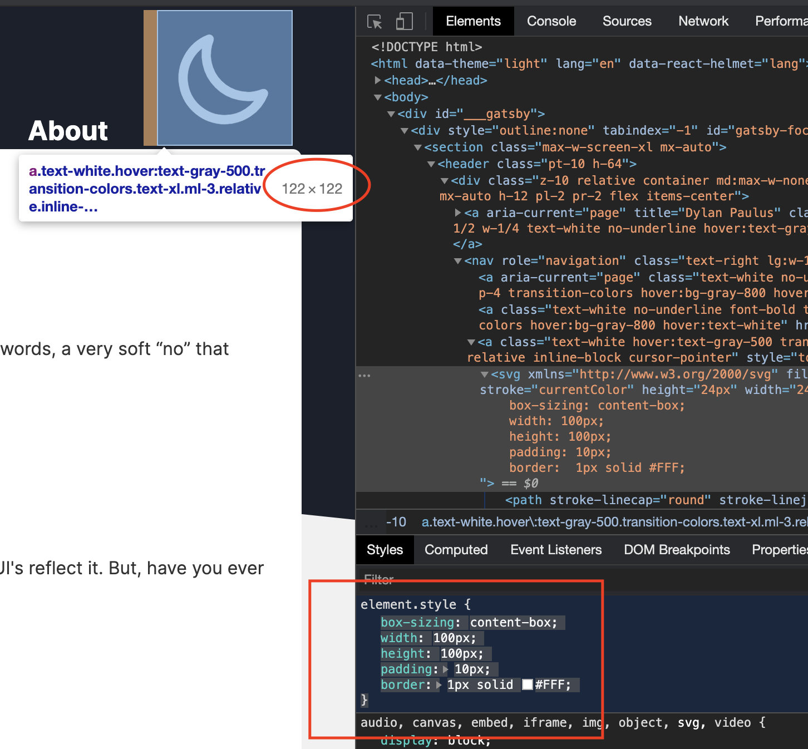
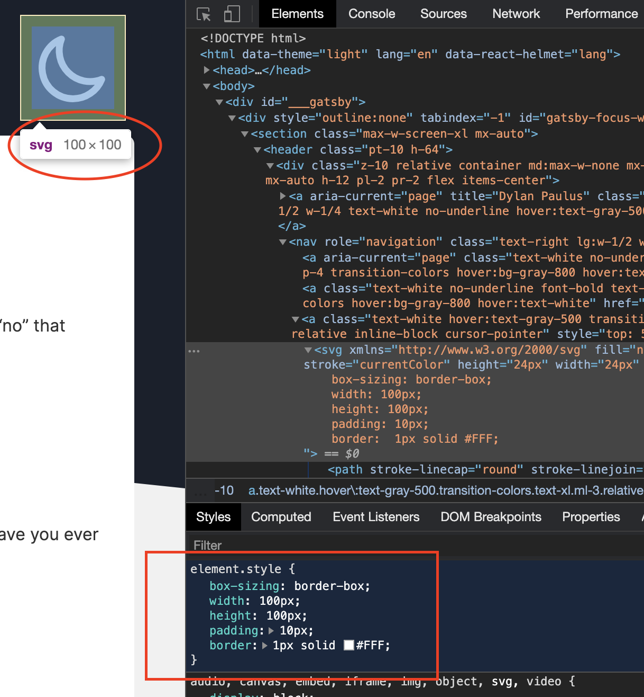

CSS is one of those technologies that has a low barrier to entry (good thing 🎉), but because of this sometimes how it works can seem like magic. It's easy to get started writing CSS, so we dive head first into it. Sometimes we smash our face into the concrete with frustration. Why won't my text move over yonder? Where did that scroll bar come from? How do I center this junk?

This is a series I'm starting called, "CSS: The Important Stuff". The goal is to take a dive into the mechanics of CSS so we can get a better intuition when styling and positioning elements. In part one we'll take a look at Box Model; the underlying layout of the web.

## What is the Box Model?

It comes with great danger to myself to tell you that the web is made of boxes. Yes, it's boxes all the way down. Take a look at this website—open the Element Inspector in the browser's dev tools and add `* { border: 1px solid red; }`. Look at all those fine boxes.

<div class="full-bleed">
  
</div>

The browser uses boxes to layout and render our websites. Within each box there are four properties: content, padding, border, and margin. [Boxes are like onions, they have layers.](https://youtu.be/-FtCTW2rVFM?t=44) Each property defines the size of our box (ie. width and height), styling, and how content around the box flows.

- **Content** is what we're usually thinking of when we create HTML elements. Text, images, video, etc. This is at the center of the box
- **Padding** gives space around the edges of the content. Separating the content from the border
- **Borders** are used to separate boxes from each other—as seen in our red border example above
- **Margin** is non-stylistic spacing _around_ the box. This is useful to separate boxes from each other and position boxes



## Why does this matter?

### Dimensions

There are different ways to determine the width and height of a box. Is the box's dimensions determined by all its layers (margin, border, padding, content)? Or is it determined by the content?

The browser made a choice in `box-sizing` and the default is `content-box`. When we give our element a width and height, lets say `.box { width: 100px; height: 100; }` , the default behavior with `content-box` is to give the content layer the width and height of 100px. But, the box still has extra layers with padding and border. We would assume if we gave the element of 100px that it would be 100px, but the browser needs to add the values of padding and border on top of the content to get its "rendered dimensions".

Given the styling on our moon icon below, what would you expect the width and height to be on the box?

```css
.moon {
  box-sizing: content-box;
  width: 100px;
  height: 100px;
  padding: 10px;
  border: 1px solid #FFF;
}
```



That's easy it's 100px... wait, 122px, what? How did we get 122px? Remember when we gave the width and height of 100px it only applies to the **content** layer. We also applied a **padding** of 10px on _each_ side of the box and a 1px **border** around it. If we were to calculate the width of the box, we start with 100px, add 10px for the left padding, add 10px for the right padding, add 1px for the left border, and finally 1px for the right border.

$$
100px + 10px + 10px + 1px + 1px = 122px
$$

Seems a little counter intuitive—if I set my box to have a 100px width then it should be 100px darn-it! Luckily, there are more ways for the browser to calculate a box's size. When I think of the size of a box, I think of `border-box` . Think of the layers of a box, and when assigning box-sizing think of the value as being cascading. When an element has `content-box` that means the browser determines the size of a box starting from content and adding any child layers. Since there are no children to content width/height only applies to content. When using `border-box`, width/height is set for the border, padding, and content.

Let's take a look at the same moon icon, but apply `border-box` instead.

```css
.moon {
  box-sizing: border-box;
  width: 100px;
  height: 100px;
  padding: 10px;
  border: 1px solid #FFF;
}
```



What we see is something quite different, the width and height of the moon is now a hard 100x100. This isn't magic though, the missing dimensions have to come from somewhere. Using `border-box` the **content** layer gets shrunk to make room for **padding** and **border**. With `content-box` our width was guaranteed to be 100px, but what is the width of our content now with `border-box`?

$$
100px - 10px - 10px - 1px - 1px = 78px
$$

To me `border-box` is easier to intuit and reason around, and becomes my default, but if the width and height of the content matters more than the visible box itself, use `content-box`.

<br />

## References

- [Introduction to the CSS basic box model](https://developer.mozilla.org/en-US/docs/Web/CSS/CSS_Box_Model/Introduction_to_the_CSS_box_model)
- [The box model](https://developer.mozilla.org/en-US/docs/Learn/CSS/Building_blocks/The_box_model)
