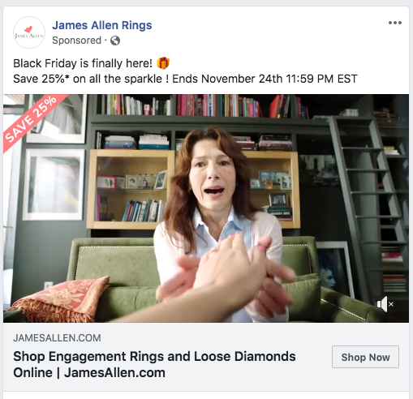
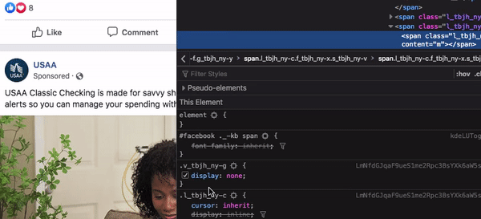

Many sites try to avoid our ad blockers through limiting content or just straight out pleaing. Other companies are looking at encrypting any kind of indicator that screams "AD!" through obfuscation and other fancy techniques--confusing ad blockers. Here we'll look at some interesting techniques Facebook deploys to ensure we view their ads.

### What does a Facebook ad look like?

Facebook ads take the form of a card containing the text 'Sponsored' (as shown below).



At first glance blocking these ads seems simple. Look for elements with the text containing 'Sponsored'. Maybe even look at the class names to be more specific. Then, slap on a good-ol' _display: none;_. Hold up cowboy--it's a little bit more complex than that!

First, Facebook doesn't actually have 'Sponsored' in their HTML. At least, not together as we would think. In the DOM, 'Sponsored' is actually broken up character by character.
<br /><br />

Instead of:

```html
<span>Sponsored</span>
```

In Facebook it _(kinda)_ looks like:

```html
<span>
  <span>S</span>
  <span>p</span>
  <span>o</span>
  <span>n</span>
  <span>s</span>
  <span>o</span>
  <span>r</span>
  <span>e</span>
  <span>d</span>
</span>
```

Notice the _'kinda'_ above? Facebook actually doesn't put the text directly in the DOM. Instead, it's embeded in [data attributes](https://developer.mozilla.org/en-US/docs/Learn/HTML/Howto/Use_data_attributes).

So really it looks like:

```html
<span>
  <span data-content="S"></span>
  <span data-content="p"></span>
  <span data-content="o"></span>
  <span data-content="n"></span>
  <span data-content="s"></span>
  <span data-content="o"></span>
  <span data-content="r"></span>
  <span data-content="e"></span>
  <span data-content="d"></span>
</span>
```

### Obfuscation

This kind of structure seems relatively easy to block. It can even be achieved in a few lines of CSS. We'll write a quick CSS ad blocker! It'll look for a sequence of 'Sponsored' as data attributes, then hide it.

```css
span[data-content="S"]
  + span[data-content="p"]
  + span[data-content="o"]
  + span[data-content="n"]
  + span[data-content="s"]
  + span[data-content="o"]
  + span[data-content="r"]
  + span[data-content="e"]
  + span[data-content="d"] {
  display: none;
}
```

What's the catch? Well... I'm glad you asked!
To block against this simple ad blocker, Facebook deploys a few techniques.

First, I simplified the _true_ structure of how the 'Sponsored' text is displayed. Remember how Facebook uses data attributes? Well, those span's are actually nested. This is to prevent the adjacency modifier seen in our CSS example `+`

```html
<span>
  <span>
    <span data-content="S"></span>
  </span>
  <span>
    <span data-content="p"></span>
  </span>
  <span>
    <span data-content="o"></span>
  </span>
  <span>
    <span data-content="n"></span>
  </span>
  <span>
    <span data-content="s"></span>
  </span>
  <span>
    <span data-content="o"></span>
  </span>
  <span>
    <span data-content="r"></span>
  </span>
  <span>
    <span data-content="e"></span>
  </span>
  <span>
    <span data-content="d"></span>
  </span>
</span>
```

But, this doesn't completely ruin our CSS ad blocker. We can refer to the parent of the data attribute and drill down.

```css
span
  span[data-content="S"]
  + span
  span[data-content="p"]
  + span
  span[data-content="o"]
  + span
  span[data-content="n"]
  + span
  span[data-content="s"]
  + span
  span[data-content="o"]
  + span
  span[data-content="r"]
  + span
  span[data-content="e"]
  + span
  span[data-content="d"] {
  display: none;
}
```

The next technique, this is the point where it gets particularly interesting, Facebook actually hides 'dummy' DOM nodes between the 'Sponsored' text. These values are entirely random characters, with a random number of DOM nodes between them. Invisible characters.
<br />

<center>
  
</center>

At this point our CSS ad blocker is completely broken. There is no way for us to possibly code every possible value in CSS. Ugh.

We could try playing around with ids or class names, but these are pretty generic. A lot of content within the Facebook code share similar classes, so there is no unique identifier in finding an _ad_.

### End

We've looked at a few techniques Facebook deploys to prevent ad blockers from... blocking ads. Using data attributes instead of straight text in the DOM, nesting DOM elements to make DOM parsing more difficult, and adding random DOM nodes between characters to obfuscate the output. The next time an ad blocker doesn't completely remove all the ads on a site, try looking at the DOM. There may be some interesting techniques at play to keep the ads flowing through!
