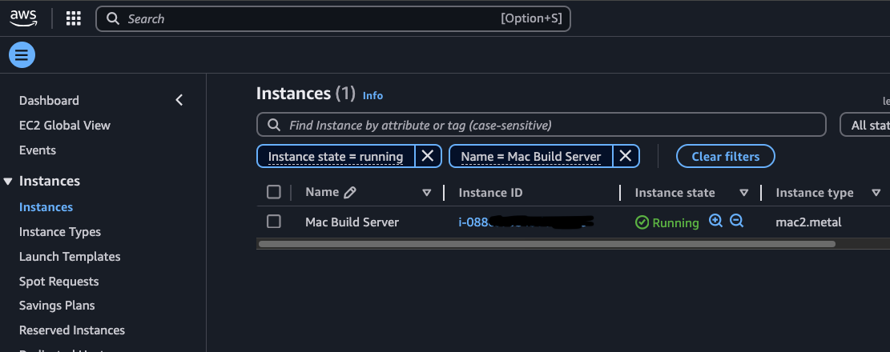
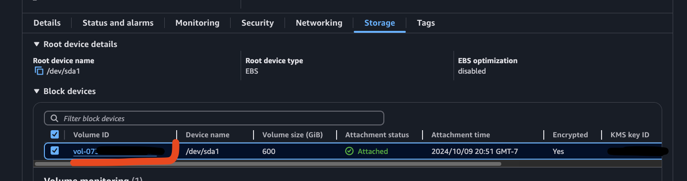
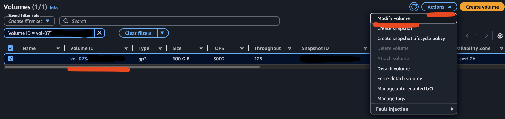
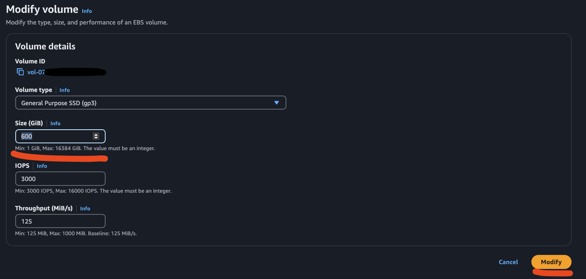
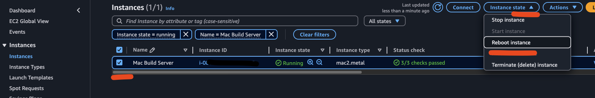
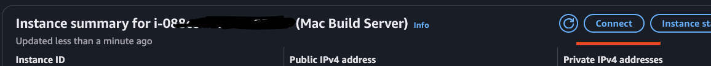

I recently ran into an issue with our Mac build machine in AWS, where the EC2 instance kept running out of disk space. It should be easy enough to bump the EBS volume size and call it a day. Wrong. No matter what I changed the volume size to, the Mac instance would not recognize the new space. What gives?
After some digging, I found that Mac requires us to resize the OS APFS (Apple File System) container after providing the volume with more space. Let’s walk through, from the start, how to increase the size of an EBS volume on a Mac AWS instance.

**Increase EBS Volume Size**

In the EC2, under Instances, select the instance that needs the volume resized.



Once inside the instance, select _Storage_ and the volume that needs to be resized.



Then, with the volume selected, choose _Modify Volume_ from the _Actions_ dropdown.



Update _Size_ to be the new desired size of the volume.



After the volume has been resized, we need to reboot the EC2 instance. Navigate back to the instance dashboard and select _Instance State_ > _Reboot instance_.
This may take some time for the instance to fully reboot.



But once the instance is back up and in a healthy state, connect into the instance by going into the instance dashboard and selecting _Connect_.
Use whichever method you prefer to connect to the instance.



Now we can see how much disk space this instance has. To do this run `df -h` or _diskutil_:

```bash
diskutil list external physical
```


At this point you will notice that even though the volume has been increased, the OS has not recognized the new space. `diskutil` and `df` is showing the old volume size.
The Apple file system doesn't expand automatically to fill the new space to avoid potential data loss, and provide users control over the space on the system.

To expand APFS use the new space run the following commands:

First, repair the disk to fix and prevent any potential problems:

```bash
PDISK=$(diskutil list physical external | head -n 1 | cut -d " " -f 1)
yes | sudo diskutil repairDisk $PDISK
```

Finally, resize the APFS container to take advantage of the new space:

```bash
APFSCONT=$(diskutil list physical external | grep "Apple_APFS" | tr -s " " | cut -d " " -f 8)
sudo diskutil apfs resizeContainer $APFSCONT 0
```

After running the above commands, you will see the new space reflected by again running `df -h` or `diskutil list external physical`!
